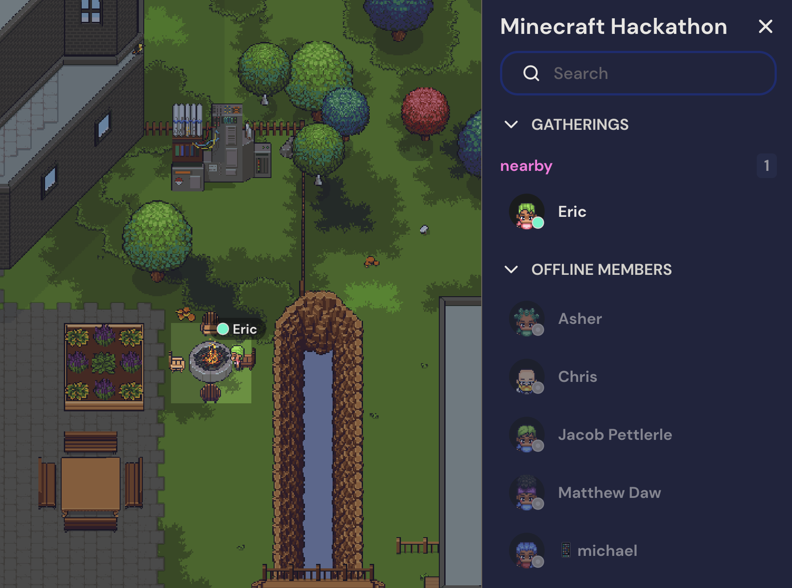
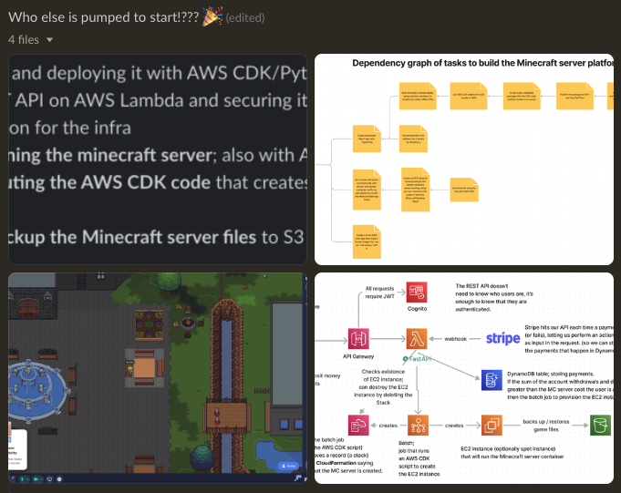
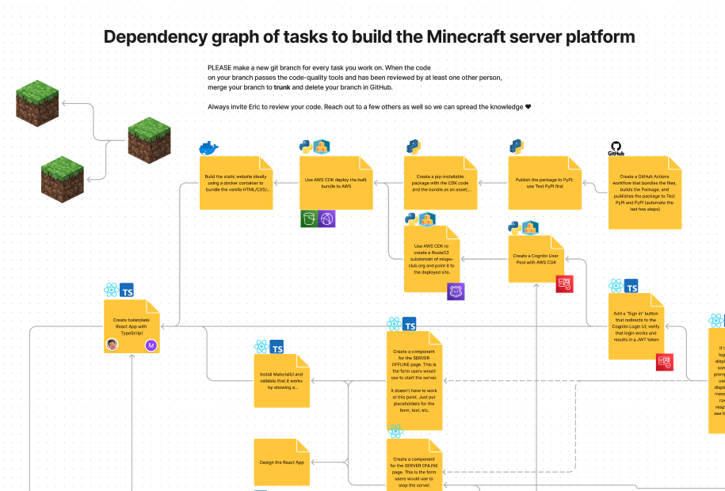
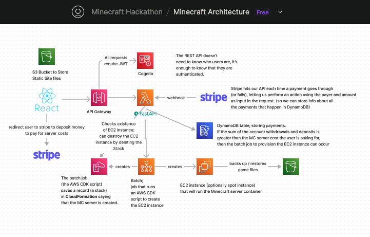

# 📣 Welcome to the December 2022 Minecraft Hackathon


## Contributing

The setup has only been tested for Linux and MacOS, not Windows :(.
If you're on windows, you'll have the best contributor experience using the Windows Subsystem for Linux 2 (WSL2).

## Useful links

> 💡 Click the images to go to each collaboration tool.

> 💡 Bookmark this repository so you can get quick access to these links.

| | |
|:-------------------------:|:-------------------------:|
|<a href="https://app.gather.town/invite?token=f8SJlx7bS9KO6cOWvqIW" target="_"></a>  <br/>Our virtual park (for remote collab) |  <a href="https://join.slack.com/t/rootskiio/shared_invite/zt-13avx8j84-mocJVx5wFAGNf5wUuy07OA" target="_"></a> <br/>Slack, in the `#hackathon` channel |
|<a href="https://www.figma.com/file/LzVP5Ed3i7NQqOkw6YbMVG/Untitled?node-id=0%3A1&t=uW2UsnZVnTNStUjm-1" target="_"></a> <br/>Roadmap, tasks  |  <a href="https://www.figma.com/file/6y4vDowRkIZPTYOztIxgy7/Minecraft-Architecture?node-id=0%3A1&t=5JKxB5ylSnLLDZ4b-1" target="_"></a> <br/>Architecture|

### How do I run this project locally?

```
# install "just"; it's like "make", but less frustrating
brew install just

# install the project's python packages and pre-commit
just install
```

Alternatively, without brew:
```
curl --proto '=https' --tlsv1.2 -sSf https://just.systems/install.sh | bash -s -- --to <DEST IN YOUR PATH>
```

where `DEST IN YOUR PATH` refers to a directory that is present in your `$PATH` environment variable. For example, you might have in your `~/.bashrc` the line `PATH=~/bin:$PATH` to look for programs in `~/bin` first, which would be the "DEST" supplied above.

You also need `node` to run `pre-commit`, which you can install with `brew install nvm` and `nvm install 18`.


### How do I add code?

#### Branching strategy: trunk-based development with feature branches

We use pull requests. Create new branches based on `trunk` for experimentation, then open a PR for it.
You don't have to wait until you want to merge code to open a PR. For this project, the main purpose of doing PRs
is to share knowledge and get early feedback on your ideas.

#### Linting

Passing the `pre-commit` checks isn't a huge deal. They are mostly for your own benefit to prevent you
committing things to the repo that you don't want. You can always override `pre-commit` by running

```bash
# run all of the quality checking tools against your code
just lint
```

```bash
# skip the quality checking tools locally
git commit -m "I really want to commit this large file" --no-verify
```

#### Git configuration

> 📌 Note: you may want to use a different email/username for this repository than
> you typically use on your development machine. You can set your git settings locally
> like so:

```bash
git config --local user.email my-personal-email@gmail.com
git config --local user.user my-github-username
```
#### Notes on commits

DON'T COMMIT...

- credentials. Feel free to put them in a `.env` file, but make sure it's gitignored!
- large files (large CSV, ML model weights, C binaries, video, etc.)
  use git LFS rather than committing it directly.
- unformatted code

The pre-commit hooks setup for this repo when you ran `just install` will remind you
about these each time you commit :)
